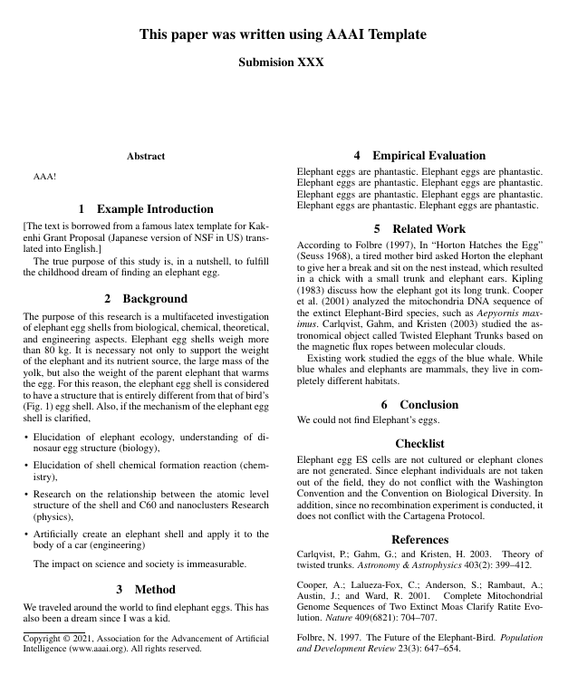

# aaai-template

[](https://travis-ci.org/guicho271828/aaai-template)

For the frequent attendants of top-tier AI conferences!

This repository contains templates and makefiles for:

+ Flagship conferences: AAAI,ECAI,IJCAI,JAIR,Neurips,ICML,ICLR,NAACL,CVPR
+ JSAI, a local Japanese non-refereed conference.
+ *New* Grammarly style --- It typesets a paper with a single column, without hyphenations and page numbers.
  It is convenient for checking the grammar with [Grammarly grammar checking service](https://app.grammarly.com/).

Requirements: GNU Make, TexLive, inkscape, perl, GNU awk (gawk) (instead of awk in BSD/OSX).
Note that it is developed and tested on Fedora Linux.

**Update (2023/06/14):**

+ We significantly refactored the directory structure.
  This made the repository clean, but the camera-ready submission script became more complicated.
  (more path rewriting rule for camera-ready submission, to reorganize the directory structure for archiving.)
+ The camera-ready script detects `minted` package and runs `make` multiple times
  with finalizecache/frozencache options to avoid `--shell-escape` issue.

**Update (2024/05/07):**

+ We slightly altered how the appendix is generated.
  Now, it builds two versions of appendix:
  1. First, it is included in the main paper by default, following the convention in ICLR, ICML, etc.
     Arxiv submission, which requires a single tex source file, also uses this version.
  2. Second, it also generates `standalone-supplement.pdf` that has its own title,
     following the convention in AAAI, IJCAI, etc.


[](./example.pdf)

# File structure

* `<name>.tex`
  * Toplevel file for the main paper, which immediately calls `\input{main.tex}`.
    This quirky convention is to satisfy the requirement from AAAI, where
    the submitted tex file must follow a certain naming convention such as `PLT-AsaiM.37`.
    `<name>` defaults to `default`, and can be modified from the `Makefile`.
    The file is autogenerated.
  * → `main.tex`
    * The true toplevel file for the main paper containing the preamble.
    * → `styles/header.sty`
      * Part of the preamble shared by `main.tex` and `supplemental.tex`.
      * This file also contains conference-specific code.
        You should uncomment the part for the conference you plan to submit
      * → `styles/general.sty`
        * general custom commands
      * → `styles/abbrev.sty`
        * custom commands for simple abbreviations
      * → `styles/math.sty`
        * math commands
      * → `styles/patches.sty`
        * Contains fixes for ill-behaving conference style files.
          The fix includes \PassOptionsToPackage and \AddToHook which ensures
          correct initialization of packages.
      * → `styles/confs/[aaai,cvpr,ecai,grammarly,iclr,icml,ijcai,jair,jsai,naacl,neurips].sty`
        * Conference-specific style files loosely following the templates provided by the conference.
          These files further loads the official style files provided by the conference/journals.
        * → `styles/official/*.sty`
          * Official style files provided by the conference/journals.
    * → `body.tex`
      * The text between `\begin{document}`--`\appendix` for `main.tex`.
        This is the file you will spend most of the time editing.
    * → `supplemental.tex`
      * The text between `\appendix`--`\end{document}` for `main.tex`.
* `standalone-supplement.tex`
  * Toplevel file for the stand-alone supplementary material for AAAI, IJCAI, etc. that has its own title and author.
  * `supplemental.tex` and `main.tex` can cross-reference
    the figures, tables and sections each other using `xr` package.
  * This file has a separate `\maketitle` for some conferences
    that assume the supplements to be an individual pdf.
    For conferences which simply assume appendices, you may not need this file.

# Usage notes

This repository is mainly targeted to core Linux users.
It partially works on OSX, but some features are not available.
Also, due to incompatibility in BSD, some commands e.g. `find` may fail.

* `make` will build the paper.

* `make auto` watches the source files and builds the pdf when they are
  updated. Poor-man's (or wise-man's) Overleaf. **Linux only.**
  It uses `inotifywait` for watching files and also sends messages via inotify notification popup window.
  * Requirements: `inotify-tools` package (available from standard package managers)

* We encourage the use of [Inkskape](https://inkscape.org/) to prepare svg
  images in `img` subdirectory, which are automatically compiled into pdf figures.
  Compilation into pdf is highly recommended because
  bitmap formats like png have the risk of resulting in blurry images.
  They also increase the file size significantly compared to the vector data in pdf-based figures.
  * Requirements: `inkskape` package (available from standard package managers)
  * Resources that are not compiled from svg should be in `img/static` directory.

* `make submission`, `make archive`, `make arxiv` :
  These `make` targets will create a `<name>.submission` directory and prepare the camera-ready
  tex files. There are sometimes extensive instruction for preparing them,
  such as https://www.aaai.org/Publications/Author/icaps-submit.php .

  * These camera-ready submissions sometimes do not allow the use of `\input{}` command.
    When you run `make submission`, the results generated in the `<name>.submission` directory will have
    * A single, flattened tex file whose `\input` commands are inlined completely
    * All image files referenced by the text are renamed and relocated to this root directory
      (AAAI Press does not allow placing images in the nested subdirectories)
    * Garbage files (log files etc.) are removed.
  * All `\input{}` commands must be at the beginning of line, nothing before or after it.
    Otherwise it may remove some necessary text.
  * `make archive` compresses the `<name>.submission/` directory
    and creates a zip file and a tar.gz file containing the same contents.
    Note that AAAI Press does not accept tar.gz files.
    Additional style files are removed because they are not allowed.
  * `make arxiv` is same as `make archive`, but it does not remove the style files.
    This feature is therefore useful when submitting the paper to Arxiv.

* In `rebuttal/` directory, there are several templates useful for conference/journal rebuttals.

  * `make` will build `journal-rebuttal.pdf`. It has
    `\begin{review}...\end{review}` and `\begin{reply}...\end{reply}` environments
    which supports cross-references through `\label`.
  * (Exclusive to emacs) `rebuttal.org` is an [org-mode](orgmode.org) text file which is useful for
    organizing thoughts and exporting it to an ASCII text file
    for conference systems that accept only plaintext rebuttals, e.g., http://easychair.org/ .
    It is set up so that it will automatically export the file to an ASCII file upon saving the buffer
    and show the word count in the mode line.


# If you have enough space in your paper, please cite me

``` bibtex
@article{aaai-template,
    author = {Asai, Masataro},
    title = {{This paper was written using AAAI Template \url{github.com/guicho271828/aaai-template}}},
    year = {2019}
}
```
